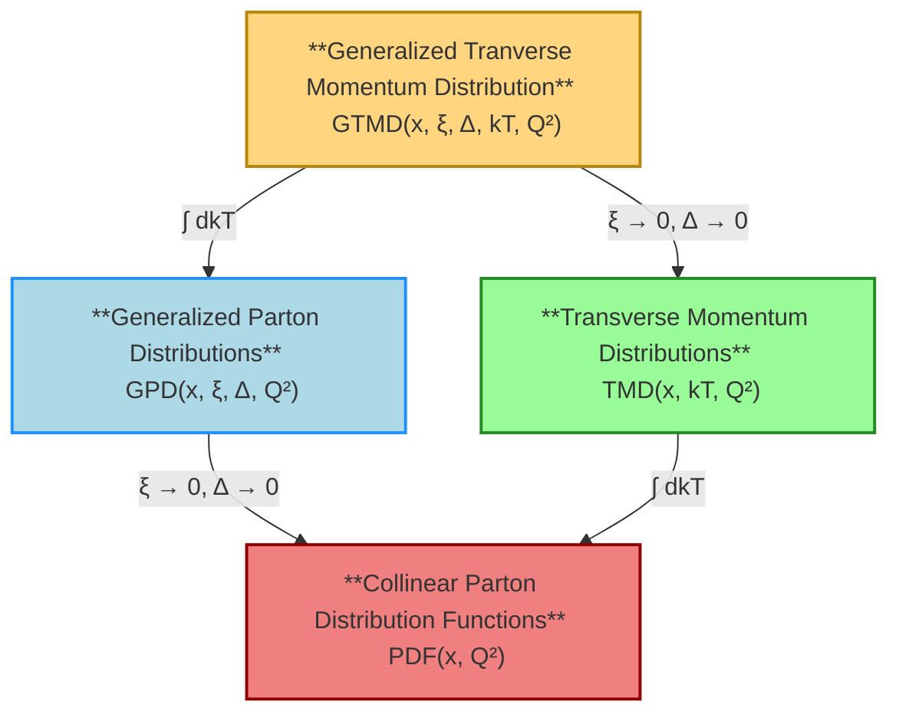

  

    
    
    
    
    

  <b>NeoPDF</b> is a fast, reliable, and scalable interpolation library for <b>Non-Perturbative Distribution Functions</b>
  with <b>modern features</b> designed for both present and future hadron collider experiments:

  <ul>
    <li>
    

      Beyond interpolations over the kinematic variables (<b>x</b>, <b>ξ</b>, <b>Δ</b>, <b>kT</b>, <b>Q²</b>), NeoPDF
      also supports interpolations along the nucleon numbers <b>A</b> (relevant for <b>nuclear</b> PDFs
      and TMDs) and the strong coupling <b>αs(MZ)</b>.
    

    </li>
    <li>
    

      NeoPDF implements its own file format using binary serialization and <a href="https://lz4.org/">LZ4</a>
      compression, prioritizing speed and efficiency over human-readable formats. A command Line
      Interface (CLI) is provided to easily inspect and perform various operations on NeoPDF grids.
    

    </li>
    <li>
    

      NeoPDF is esigned as much as possible with a “no-code migration” philosophy across the various API
      interfaces (Fortran, C/C++, Python, Mathematica). It thus preserves naming conventions and method
      signatures in close alignment with LHAPDF, ensuring that existing codes can switch to NeoPDF with
      minimal or no modifications.
    

    </li>
  </ul>

## Supported distributions

  NeoPDF supports generic classes of distributions that are functions of different combinations of the kinematic
  variables. Examples of distribution functions are given in the diagram below with their simplified relationships.

## Quick Links

- [Documentation](https://qcdlab.github.io/neopdf/) | [Rust Crate Documentation](https://docs.rs/neopdf/0.1.1/neopdf/) | [C++ API Reference](https://neopdf.readthedocs.io/en/latest/)
- [Installation](https://qcdlab.github.io/neopdf/installation/)
- [Physics and technical features](https://qcdlab.github.io/neopdf/design-and-features/)
- [NeoPDF Design](https://qcdlab.github.io/neopdf/design/)
- [CLI tutorials](https://qcdlab.github.io/neopdf/cli-tutorials/)
- [Tutorials and examples](https://qcdlab.github.io/neopdf/examples/neopdf-pyapi/)

## Citation

  If you use NeoPDF, please cite the <a href="https://zenodo.org/records/17286770">software</a>
  itself and the <a href="https://arxiv.org/abs/2510.05079">paper</a>. If you are also using the
  <a href="https://arxiv.org/abs/2103.09741">TMDlib</a> interface of NeoPDF and/or
  <a href="https://arxiv.org/abs/1412.7420">LHAPDF</a>, please cite them accordingly.

> [!NOTE]
> As of v0.2.0, NeoPDF (and in particular its APIs) is stable and will fully maintain backward compatibility.
