# Features

`NeoPDF` is designed to be a modern, extensible, and high-performance library for
**generic non-perturbative functions**. This page details the physics and technical
features, [design rationale](./design.md), and future plans.

## Summary of the Current Supported Features

<div align="center">
<table style="border-collapse: collapse; width: 100%; border: 1px solid #888;">
  <tr>
    <th style="border: 1px solid #888;"></th>
    <th style="border: 1px solid #888;">Feature</th>
    <th style="border: 1px solid #888;">Status</th>
    <th style="border: 1px solid #888;">Notes</th>
  </tr>
  <tr>
    <td rowspan="5" style="text-align: center; vertical-align: middle; border: 1px solid #888;">APIs & FFIs</td>
    <td style="border: 1px solid #888;">Rust API</td>
    <td style="border: 1px solid #888;">✅</td>
    <td style="border: 1px solid #888;">Fully supported</td>
  </tr>
  <tr>
    <td style="border: 1px solid #888;">Python API</td>
    <td style="border: 1px solid #888;">✅</td>
    <td style="border: 1px solid #888;">Fully supported</td>
  </tr>
  <tr>
    <td style="border: 1px solid #888;">C/C++ API</td>
    <td style="border: 1px solid #888;">✅</td>
    <td style="border: 1px solid #888;">Fully supported</td>
  </tr>
  <tr>
    <td style="border: 1px solid #888;">Fortran API</td>
    <td style="border: 1px solid #888;">✅</td>
    <td style="border: 1px solid #888;">Fully supported</td>
  </tr>
  <tr>
    <td style="border: 1px solid #888;">Mathematica Interface</td>
    <td style="border: 1px solid #888;">✅</td>
    <td style="border: 1px solid #888;">Fully supported</td>
  </tr>
  <tr>
    <td rowspan="9" style="text-align: center; vertical-align: middle; border: 1px solid #888;">Features</td>
    <td style="border: 1px solid #888;">Nuclear PDFs interpolation</td>
    <td style="border: 1px solid #888;">✅</td>
    <td style="border: 1px solid #888;">Fully supported</td>
  </tr>
  <tr>
    <td style="border: 1px solid #888;">Strong Coupling interpolation</td>
    <td style="border: 1px solid #888;">✅</td>
    <td style="border: 1px solid #888;">Fully supported</td>
  </tr>
  <tr>
    <td style="border: 1px solid #888;">Momentum kT interpolation</td>
    <td style="border: 1px solid #888;">✅</td>
    <td style="border: 1px solid #888;">Fully supported</td>
  </tr>
  <tr>
    <td style="border: 1px solid #888;">Skeweness ξ interpolation</td>
    <td style="border: 1px solid #888;">✅</td>
    <td style="border: 1px solid #888;">Fully supported</td>
  </tr>
  <tr>
    <td style="border: 1px solid #888;">Momentum Δ interpolation</td>
    <td style="border: 1px solid #888;">✅</td>
    <td style="border: 1px solid #888;">Fully supported</td>
  </tr>
  <tr>
    <td style="border: 1px solid #888;">Different Hadronic states</td>
    <td style="border: 1px solid #888;">✅</td>
    <td style="border: 1px solid #888;">Fully supported</td>
  </tr>
  <tr>
    <td style="border: 1px solid #888;">Custom interpolation</td>
    <td style="border: 1px solid #888;">✅</td>
    <td style="border: 1px solid #888;">Supported (user-defined strategies)</td>
  </tr>
  <tr>
    <td style="border: 1px solid #888;">Multi-flavor grids</td>
    <td style="border: 1px solid #888;">❌</td>
    <td style="border: 1px solid #888;">Planned</td>
  </tr>
  <tr>
    <td style="border: 1px solid #888;">Analytical DGLAP interpolation</td>
    <td style="border: 1px solid #888;">❌</td>
    <td style="border: 1px solid #888;">Planned</td>
  </tr>
</table>
</div>

## Physics Features

### Hadron Types and PDF Classification

!!! danger "Multiple types of Convolutions"

    PDF interpolations are mainly used to convolve with partonic cross-sections in order to
    get theoretical predictions. For various technical reasons, these theory predictions are
    stored in some fast interpolating grids. Mondern interpolating libraries such as
    [PineAPPL](https://github.com/NNPDF/pineappl) supports grids with arbitrarily many
    convolutions. For instance, it support processes such as:

    ```bash
    Proton + Proton -> π + π + X
    ```

    An interpolation grid of this kind needs two different convolution functions: a (polarised) PDF for the
    protons and a fragmentation function for the pions. When users convolve this grid with the two functions,
    they must either pass the functions in the right order to avoid calculating wrong predictions
    (see this [issue](https://gitlab.com/hepcedar/lhapdf/-/issues/79) for more details). `NeoPDF` circumvents
    this issue by adding the following keys to the metadata:

    ``` yaml
    Particle: 2212/212/... # Hadron PID
    Polarized: true/false
    SetType: SpaceLike/TimeLike
    ```

### Supported distributions

`NeoPDF` supports generic classes of distributions that are functions of different combinations
of the kinematic variables. Examples of known distribution functions are given in the diagram
below with their simplified relationships.

```mermaid
graph TD

A["<b>Generalized Tranverse Momentum Distributions</b> <br> GTMD(x, ξ, Δ, kT​​, Q²)"]

A -->|∫ dkT| B["<b>Generalized Parton Distributions</b> <br> GPD(x, ξ, Δ, Q²)"]
A -->|ξ → 0, Δ → 0| C["<b>Transverse Momentum Distributions</b> <br> TMD(x, kT, Q²)"]

B -->|ξ → 0, Δ → 0| D["<b>Collinear Parton Distribution Functions</b> <br> PDF(x, Q²)"]
C -->|∫ dkT| D

style A fill:#8B4513,stroke:#D2691E,stroke-width:2px
style B fill:#1E3A5F,stroke:#4169E1,stroke-width:2px
style C fill:#2F4F2F,stroke:#3CB371,stroke-width:2px
style D fill:#8B2F2F,stroke:#CD5C5C,stroke-width:2px

```

<div align="center" markdown="1">

</div>

In order to support these distributions, `NeoPDF` provides Hermite Cubic Spline and Chebyshev
interpolation strategies for up to 6D data.

### Multi-Flavor Grids (Planned)

`NeoPDF` will support grids with varying numbers of active flavors $n_f$, providing a consistent
treatment of heavy quark effects across all scales. Advanced schemes like FONLL and ACOT require
careful handling of flavor thresholds and mass effects. `NeoPDF`'s multi-flavor support will enable:

  - Precision predictions for heavy flavor production
  - Proper matching across flavor thresholds
  - Consistent treatment of charm and bottom quark effects

### Analytical Interpolation (Planned)

Future versions will support **DGLAP**-based analytical interpolation. Such an analytical-based
interpolation will provide:

  - Consistent treatment of scale evolution
  - Reduced interpolation artifacts
  - More accurate extrapolation beyond the grid boundaries

## Technical Features

### Language Interoperability

`NeoPDF` provides native APIs across multiple programming languages, enabling seamless integration
into diverse computational workflows:

- **Native Rust API**:
  The core library is written in Rust, providing zero-cost abstractions, memory safety, and high
  performance. Rust's ownership system ensures thread safety and prevents common programming errors
  that could lead to incorrect physics results.

- **Python Bindings**:
  Comprehensive Python interface using PyO3, enabling integration with the rich ecosystem of
  scientific Python libraries (NumPy, etc.). This is crucial for data analysis, visualization,
  and integration with existing physics analysis frameworks.

- **C/C++ Bindings**:
  Direct C and C++ interfaces for integration with legacy codes and high-performance computing
  applications. The C API provides a stable ABI for long-term compatibility, while the C++ API
  offers object-oriented convenience.

### No-Code Migration

`NeoPDF` maintains API compatibility with LHAPDF, enabling seamless migration:

- **Drop-in Replacement**:
  Existing LHAPDF code can often be migrated by simply changing import statements, with no
  modifications to the core physics logic required.

- **Preserved Function Signatures**:
  Key functions like `xfxQ2()`, `alphasQ2()`, and `mkPDF()` maintain the same signatures as
  LHAPDF, ensuring compatibility with existing analysis codes.

The following symbols have an exact match with their LHAPDF counterparts.

*Module-level:*
`setVerbosity()`, `verbosity()`, `getPDFSet()`, `mkPDF()`, `mkPDFs()`,
`availablePDFSets()`, `paths()`, `setPaths()`, `pathsAppend()`, `pathsPrepend()`.

*`PDFSet` class:*
`name`, `size`, `description`, `errorType`, `lhapdfID`, `mkPDF()`, `mkPDFs()`, `info()`.

*`PDF` class:*
`xfxQ()`, `xfxQ2()`, `alphasQ()`, `alphasQ2()`, `flavors()`, `hasFlavor()`,
`inRangeX()`, `inRangeQ()`, `inRangeQ2()`, `inRangeXQ()`, `inRangeXQ2()`,
`memberID`, `lhapdfID`, `orderQCD`, `xMin`, `xMax`, `q2Min`, `q2Max`,
`quarkMass()`, `quarkThreshold()`, `description`, `set`.

This compatibility is crucial for the physics community, as it allows for immediate adoption
without requiring extensive code rewrites or validation efforts.

### Extensible Interpolation

`NeoPDF`'s modular architecture enables easy extension and customization:

- **Pluggable Interpolation Strategies**:
  The library supports multiple interpolation algorithms (linear, cubic, Chebyshev)
  for up to 6D data and can be extended with custom interpolation schemes.

- **Custom Grid Types**:
  The framework can accommodate new grid formats and data structures, enabling support for emerging
  PDF sets and specialized applications.

- **Performance Tuning**:
  Different interpolation strategies can be selected based on the specific requirements of accuracy
  vs. speed, allowing optimization for different use cases.

### Performance Optimization

`NeoPDF` is designed for high-performance computing environments:

- **Zero-Cost Abstractions**:
  Rust's compilation model ensures that high-level abstractions don't incur runtime overhead, providing
  both safety and performance.

- **Cache-Friendly Design**:
  Data structures are optimized for modern CPU cache hierarchies, reducing memory access latency and
  improving performance for large-scale calculations.

- **SIMD Optimization**:
  The library can leverage CPU vector instructions for parallel evaluation of multiple points, crucial
  for Monte Carlo event generation and large-scale simulations.

- **Benchmarking**:
  Comprehensive benchmarking against LHAPDF ensures that performance improvements don't come at the
  cost of accuracy, maintaining the precision required for physics calculations.

### Thread and Memory Safety

`NeoPDF` leverages Rust's safety guarantees for robust multi-threaded applications:

- **Memory Safety**:
  Rust's ownership system prevents common memory errors (use-after-free, double-free, data races)
  that could lead to incorrect physics results or program crashes.

- **Thread Safety**:
  Built-in support for safe concurrent access to PDF objects, essential for parallel event
  generation and Monte Carlo simulations.

- **FFI Safety**:
  Careful design of the foreign function interface ensures that safety guarantees extend to Python,
  C, and C++ code, preventing crashes and undefined behavior.
