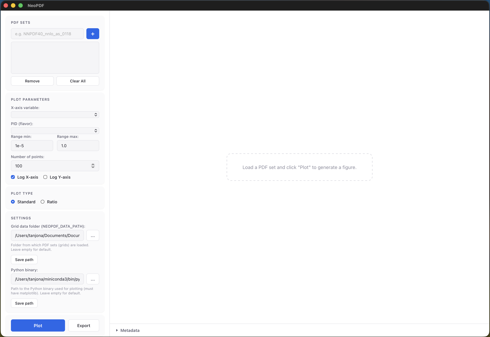

# GUI Interface

`NeoPDF` ships with a cross-platform desktop application built with [Tauri](https://tauri.app/)
that provides an interactive graphical interface for exploring and plotting PDF sets.

  

## Loading PDF Sets

Enter the name of a PDF set (e.g. `NNPDF40_nnlo_as_0118`) in the text field at the top and
click the **+** button to load it. Multiple sets can be loaded simultaneously and will appear
in the list below. Select one or more sets to compare them on the same plot.

Use **Remove** to unload the selected sets or **Clear All** to start fresh.

## Plot Parameters

Once a set is loaded, the GUI automatically detects the active parameter dimensions:

- **X-axis variable** — choose which variable to sweep (e.g. `x`, `Q2`)
- **PID (flavor)** — select the parton flavor to plot (gluon, u, d, s, ...)
- **Fixed variables** — set constant values for any remaining active dimensions
- **Range min / max** — define the sweep range for the x-axis variable
- **Number of points** — control the sampling density
- **Log X-axis / Log Y-axis** — toggle logarithmic scales

## Plot Types

- **Standard** — plots the PDF value (with uncertainty bands) as a function of the chosen variable
- **Ratio** — divides all sets by a selected reference set, useful for comparing shapes and uncertainties

Click **Plot** to generate the figure. The plot appears in the right panel as a high-resolution
PNG rendered via matplotlib.

## Exporting

Click **Export** to save the current plot to disk. Supported formats are **PNG**, **PDF**, and **SVG**.

## Settings

The **Settings** section at the bottom of the controls panel lets you configure:

- **Grid data folder** (`NEOPDF_DATA_PATH`) — the directory from which PDF set grids are loaded.
  Leave empty to use the default location (`~/.local/share/neopdf`).
- **Python binary** — path to the Python interpreter used for matplotlib plotting.
  The Python environment must have `matplotlib` installed. Leave empty to use the system default (`python3`).

Both settings are persisted across sessions.
